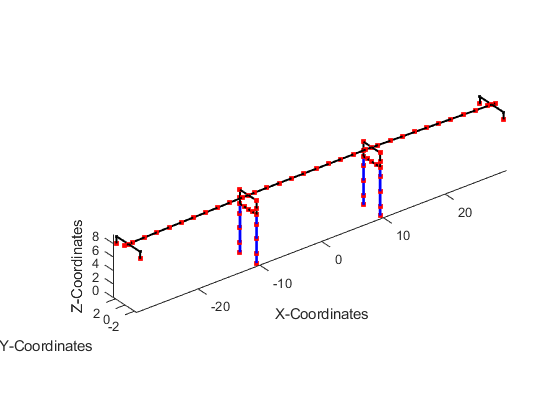

# 基于Python/Matlab的OpenSees模型绘制及振型检验

该repository包含基于Python/Matlab的绘制opensees模型及模态的相关代码。

用户需要查看的唯一文件是“runme.py”，所有其他文件都只是函数。

允许用户使用python/Matlab的相关命令来绘制和检查正在建立的结构模型。但是项目仅适用于三维的模型。你也可以使用项目提供的“ modalAnalysis.tcl”生成分析振型所需的文件“ eigenVectors_modal.txt”和“ Periods_modal.txt”。

“ Frame_model.tcl”提供了一个示例，通过Opensees运行此文件，生成所需的输入文件。

如果您发现任何错误或有任何请求的添加，请告诉我。

## 效果示例



## 如何使用代码

1.建立模型。您的模型不必是可以进行分析的完整模型。例如，一堆浮动节点就可以了。这样，您可以在构建模型时监视模型的渐进过程。

2.建立模型后，在OpenSees中使用“print”命令将整个模型打印到文本文件。在提供的示例中，在文件末尾的位置，在该位置插入命令“ print model.txt”，然后在OpenSees中执行文件“ Frame_model.tcl”将生成此代码所需的文件。

```tcl
#--------------------------------------
# Print the model
# --------------------------------------
# Delete the old one first
file delete model.txt
# Print the new one
print model.txt
```
3.将model.txt文件保存在代码目录后。

4.现在，您可以使用“ model_plot”功能。在此之前你需要指定相关输出信息：
```python
python---runme.py
eig = 7 # 你要分析的模态数
Xamp = 10 # X轴放大比例
Yamp = 10 # Y轴放大比例
Zamp = 10 # Z轴放大比例
vw = '3d' # 视图类型 包括'xy' 'yz' 'xz' '3d'
plot_your_model(Xamp,Yamp,Zamp,eig,vw)
```
```Matlab
clc
clear
vw='3d';Npf=0;Epf=0;Xamp=10;Zamp=10;eig=0;node_list=[];nargin=10;
[T,phi_mds,Mnstar]= model_plot(vw,Npf,Epf,Xamp,Yamp,Zamp,eig,node_list);
% vw:       View Plane (xy, xz, yz or 3d)
% Npf:      node label plot flag (1 for labels, 0 for none)
% Epf:      element label plot flag (1 for labels, 0 for none)
% Xamp:     Amplification on Xcoord disps
% Yamp:     Amplification on Ycoord disps
% Zamp:     Amplification on Zcoord disps
% eig:      number of mode shapes, 0 to do nothing
% node_list:list of nodes to return the modal displacements at, returns a
%           cell with eig number of cells and node_list x ndf array in each
```
5.在python执行“ model_plot”功能后，它将要求您选择OpenSees生成的“ model.txt”文件。加载后，代码将绘制模型的3D图形以进行检查。

此外，您可以使用此代码检查结构的mode shapes。
1.您需要使用提供的“ modalAnalysis.tcl” TCL脚本将对对结构进行模态分析。在模型中使用此脚本，除了会生成两个文件以外，还将在屏幕上返回模态值：一个文件包含eigenvectors，另一个文件将列出模型的周期。

```Tcl
source modalAnalysis.tcl
modalAnalysis 7 1 "_modal"
```

2.绘制结构振型将导致代码也要求您提供特征向量和周期文件（eigenVectors_modal.txt和Periods_modal.txt）。

3.代码将为不同振型绘制单独的图形，并在标题处标出了模态编号和振动周期。

## 可绘制单元和结点
将绘制以下单元：
* ElasticBeam3d
* CorotTrussSection
* TrussSection
* FlatSliderSimple3d
* TwoNodeLink
* ZeroLength
* ForceBeamColumn3d
* DispBeamColumn3d

如果您使用上面未列出的任何单元，则代码将不会对绘制该单元。

如果单个节点具有质量，则将其绘制为红色，如果没有质量则节点将绘制为蓝色。

你可以添加相关代码，以绘制相关单元。欢迎补充代码。

## 注意事项

没有绘制负载模式。

没有绘制约束。

在绘制模式形状时，不会绘制单元元素变形（即沿构件的截面曲率）。

您还可以使用它来绘制执行pushover或动态分析之后的模型最终状态。只需在TCL模型中完成分析的步骤和过程中放置​​打印命令，像使用上述“ model.txt”文件一样使用它。

# Licensing
Copyright (C) 2019  HaoxinGuo

All of these programs are copyrighted under the GNU General Public License as published by the Free Software Foundation, version 2. In short, you can employ them freely (assuming you cite the original source and the relevant publication) but if you want to build upon, extend or re-distribute them, then the derivative software products will also have to be covered under the GPL (i.e. be free software). Other licensing options are negotiable.

# Disclaimer
These programs are distributed in the hope that it will be useful, but WITHOUT ANY WARRANTY; without even the implied warranty of MERCHANTABILITY or FITNESS FOR A PARTICULAR PURPOSE. See the GNU General Public License for more details.